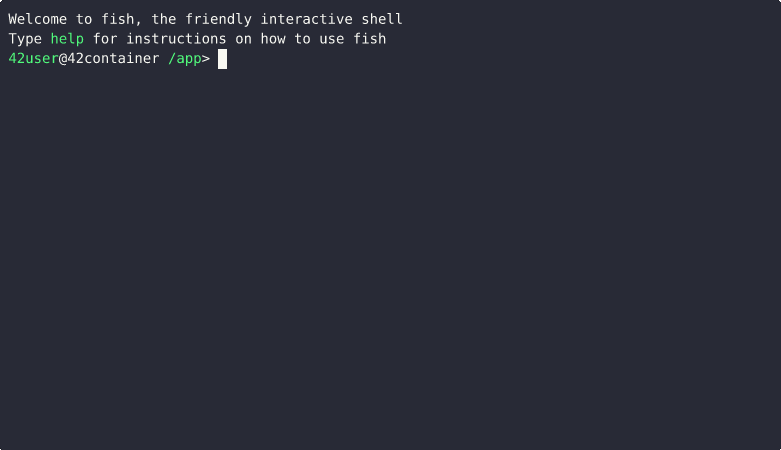

_This project has been created as part of the 42 curriculum by mlermo-j and jperez-m._

---

# Minishell

## Description

The goal of this project is to create a **simple shell in C** that mimics the core behavior of a Unix Bash shell. The shell reads user input (interactive or piped), parses it into an Abstract Syntax Tree (AST), expands variables and wildcards, and finally executes the resulting commands — all while managing processes, file descriptors, signals, and environment state.

The shell supports:
- An interactive prompt via `readline`
- Built-in commands (`cd`, `echo`, `env`, `exit`, `export`, `pwd`, `unset`)
- Environment variable expansion (`$VAR`, `$?`)
- Single and double quote handling
- Pipes (`|`) and redirections (`<`, `>`, `>>`, `<<` heredoc)
- Signal handling (`Ctrl+C`, `Ctrl+D`, `Ctrl+\`)
- **Bonus:** Wildcard expansion (`*`) and logical operators (`&&`, `||`) with parentheses

The project is structured modularly: separate files handle lexing, parsing, expansion, execution, and built-in commands.  
The separation between mandatory and bonus features is achieved via conditional compilation using the `BONUS` macro.

---

## Feature List

| Feature | Mandatory | Bonus |
|---|:---:|:---:|
| Command execution (PATH resolution) | ✓ | ✓ |
| Built-ins: `cd`, `echo`, `env`, `exit`, `export`, `pwd`, `unset` | ✓ | ✓ |
| Environment variable expansion (`$VAR`, `$?`) | ✓ | ✓ |
| Single and double quote handling | ✓ | ✓ |
| Pipes (`\|`) | ✓ | ✓ |
| Redirections (`<`, `>`, `>>`, `<<`) | ✓ | ✓ |
| Heredoc (`<<`) | ✓ | ✓ |
| Signal handling (`Ctrl+C`, `Ctrl+D`, `Ctrl+\`) | ✓ | ✓ |
| Wildcard expansion (`*`) | ✗ | ✓ |
| Logical operators (`&&`, `\|\|`) with parentheses | ✗ | ✓ |

## Signals and exit codes

### Signals and system events

| Event | `$?` | Context | Description |
|---|:---:|---|---|
| `Ctrl+C` (SIGINT) | 130 | Interactive | Clears current input; prints a new prompt line |
| `Ctrl+D` (EOF) | 0 | Interactive | Exits shell when input is empty |
| `Ctrl+\` (SIGQUIT) | — | Interactive | Ignored in the shell process itself |
| `SIGINT` during heredoc | 130 | Heredoc | Cancels heredoc input; returns to prompt |
| `SIGINT` in child process | 130 | Child process | Terminates child; parent collects status via `waitpid()` |
| `SIGQUIT` in child process | 131 | Child process | Terminates child; parent collects status via `waitpid()` |
| External command | 0–255 | Child process | Command-specific code; parent collects via `waitpid()` and sets `$?` |
| Syntax error (unexpected token, unclosed quote) | 2 | Shell | Prints error message; does not exit shell — matches bash |
| Command not found | 127 | Child process | Prints error message; does not exit shell — matches bash |
| Permission denied (e.g. executing a directory) | 126 | Child process | Prints error message; does not exit shell — matches bash |

### Built-in exit codes

Built-ins run in the parent process and set `$?` directly. All match bash
exactly.

| Built-in | Success `$?` | Failure `$?` | Failure condition | Matches bash? |
|---|:---:|:---:|---|:---:|
| `echo` | 0 | — | Never fails | ✓ |
| `cd` | 0 | 1 | Directory not found, no `HOME`/`OLDPWD`, permission denied | ✓ |
| `pwd` | 0 | 1 | `getcwd()` fails (extremely rare) | ✓ |
| `export` | 0 | 1 | Invalid identifier (e.g. `export 1bad`, `export a-b`) | ✓ |
| `unset` | 0 | 1 | Invalid identifier — prints error and returns 1 | ✓ |
| `env` | 0 | 1 | Called with arguments (our impl rejects them) | ~ |
| `exit` (valid code) | 0–255 | — | Exits shell with given code (modulo 256) | ✓ |
| `exit` (too many args) | — | 1 | Does **not** exit; returns 1 | ✓ |
| `exit` (non-numeric arg) | — | 2 | Exits with code 2 | ✓ |

---

## Architecture

The shell processes each line of input through a sequential pipeline of components. Each stage transforms the data into a higher-level representation until the commands are ready to execute.

### Pipeline Overview

```
┌──────────────┐
│  User Input  │  (readline / stdin)
└──────┬───────┘
       │  raw string
       ▼
┌──────────────┐
│    Lexer     │  Splits input into tokens (words, operators, quotes)
│ (lexer.c)    │  Classifies each token: WORD, PIPE, REDIRECT, BUILTIN…
└──────┬───────┘
       │  t_token linked list
       ▼
┌──────────────┐
│   Expander   │  Resolves $VAR and $? inside expandable tokens
│(expander.c)  │  Applies quote semantics (single = no expand, double = expand)
└──────┬───────┘
       │  t_token list (values resolved)
       ▼
┌──────────────┐
│    Parser    │  Builds the Abstract Syntax Tree (AST)
│  (parser.c)  │  Produces t_node tree with t_command leaves
└──────┬───────┘
       │  t_node* (AST root)
       ▼
┌──────────────┐
│ Preprocessor │  Runs heredocs before execution; resolves wildcards (bonus)
│ (heredoc.c / │
│wildcards.c)  │
└──────┬───────┘
       │  t_node* (ready to execute)
       ▼
┌──────────────┐
│   Executor   │  Traverses AST recursively; forks processes; manages pipes
│ (executor.c) │  and redirections; collects exit codes
└──────┬───────┘
       │  exit status → $?
       ▼
┌──────────────┐
│    Output    │  stdout / stderr / files
└──────────────┘
```

### Key Data Structures

```
t_shell                             t_token (linked list)
┌──────────────────┐                ┌───────────────────┐
│ env_list  t_env*─┼──▶ [KEY=VAL]  │ value   char*     │
│ env_vars  char** │                │ type    t_tokentype│
│ last_exit_code   │                │ quote   t_quote    │
│ exit_requested   │                │ expandable  int    │
│ heredoc_count    │                │ nesting int        │
│ main_pid         │                │ next/prev  t_token*│
│ current_tokens ──┼──▶ t_token*   └───────────────────┘
│ current_ast ─────┼──▶ t_node*
└──────────────────┘                t_command (leaf data)
                                    ┌───────────────────┐
t_node (AST node)                   │ args      char**   │
┌──────────────┐                    │ fullpath  char*    │
│ type NODE_*  │                    │ builtin_type       │
│ left  t_node*│                    │ infile    char*    │
│ right t_node*│                    │ heredoc_delimiters │
│ cmd t_command│                    │ outfiles  char**   │
└──────────────┘                    │ append_modes int*  │
                                    └───────────────────┘
```

---

## AST Structure: Mandatory vs Bonus

The parser builds different trees depending on the build target. The `BONUS` macro gates the parser logic that produces `NODE_AND` and `NODE_OR` nodes.

### Mandatory — Pipes only (`NODE_CMD`, `NODE_PIPE`)

```
Input: echo hello | grep e | wc -l

                   NODE_PIPE
                  /         \
            NODE_PIPE      NODE_CMD
           /         \       └── args: ["wc", "-l"]
       NODE_CMD     NODE_CMD
         └── args:    └── args:
         ["echo",     ["grep", "e"]
          "hello"]
```

### Bonus — Logical operators (`NODE_AND`, `NODE_OR`) added

Operators are **left-associative** with equal precedence: the leftmost operator
is always evaluated first (sits deepest in the tree). The root is always the
**rightmost** operator in the absence of parentheses.

```
Input: echo a && echo b || echo c
       Parsed as: (echo a && echo b) || echo c

              NODE_OR              ← root: evaluated LAST
             /        \
         NODE_AND     NODE_CMD     ← AND evaluated FIRST (leftmost)
        /        \      └── args: ["echo", "c"]
    NODE_CMD   NODE_CMD
      └── args:  └── args:
      ["echo","a"] ["echo","b"]
```

```
Input: (echo ok && false) || echo fallback

                  NODE_OR
                 /        \
             NODE_AND    NODE_CMD
            /        \     └── ["echo", "fallback"]
        NODE_CMD   NODE_CMD
        ["echo",   ["false"]
          "ok"]

  └── parentheses control grouping / nesting level (t_token.nesting)
```

---

## Execution Flow

`traverse_tree()` walks the AST recursively. At each node it delegates to a specialized function.

### Full Execution Decision Tree

```
traverse_tree(node)
       │
       ├─ NODE_AND / NODE_OR ──▶ exec_node_logic()
       │         │
       │         ├── evaluate LEFT child  →  get exit status
       │         ├── AND: run RIGHT only if status == 0
       │         └── OR:  run RIGHT only if status != 0
       │
       ├─ NODE_PIPE ──────────▶ exec_node_pipe()
       │         │
       │         ├── pipe(pfd)           create anonymous pipe
       │         ├── fork() → LEFT child  writes to pfd[1]
       │         ├── fork() → RIGHT child reads from pfd[0]
       │         ├── close_pipe(pfd)     parent closes both ends
       │         └── wait_pipe()         collect both exit statuses
       │
       └─ NODE_CMD ───────────▶ exec_node_cmd()
                 │
                 ├── no args + no redirections? → return 0 (no-op)
                 │
                 ├─ BUILTIN? ──YES──▶ exec_builtin_parent()
                 │                         [runs in PARENT process]
                 │                    Modifies shell state directly:
                 │                    env_list, last_exit_code, cwd…
                 │
                 └─ EXTERNAL? ─YES───▶    fork()
                                     /              \
                                PARENT            CHILD
                                  │                  │
                             waitpid(pid)    exec_external_child()
                                                      │
                                               setup redirections
                                               (< > >> heredoc fd)
                                                      │
                                             execve(fullpath,
                                                    args, envp)
```

### Parent vs Child Process

```
  PARENT PROCESS                             CHILD PROCESS(ES)
  ──────────────                             ─────────────────
  Owns: t_shell state                   Receives: copy of shell at fork()
        env_list                        Changes:  do NOT affect parent env
        last_exit_code
        history (readline)

  Builtins run HERE so they                   External commands run HERE
  can mutate shell state:                     then exit — parent collects
    cd  → changes cwd, update PWD, OLDPWD     exit status via waitpid()
    export/unset → modify env_list
    exit → sets exit_requested
    echo/env/pwd → print output
```

---

## Builtins vs External Commands

```
Command received
       │
       ▼
  classify token
 (lexer / parser)
       │
       ├── builtin_type ∈ {CD, ECHO, ENV, EXIT, EXPORT, PWD, UNSET}
       │          │
       │          ▼
       │   exec_builtin_parent()         ← NO fork, runs in parent
       │          │
       │    ┌─────┴──────────────┐
       │    │  cd   → chdir()    │
       │    │  echo → write()    │
       │    │  export → env_list │
       │    │  unset → env_list  │
       │    │  pwd  → getcwd()   │
       │    │  env  → print list │
       │    │  exit → flag+code  │
       │    └────────────────────┘
       │
       └── builtin_type == EXTERNAL (or WORD with fullpath)
                  │
                  ▼
             fork() child
                  │
         exec_external_child()
                  │
       ┌──────────┴─────────────┐
       │  handle_input_redir()  │  open infile / heredoc_fd → dup2 STDIN
       │  handle_output_redir() │  open outfile(s) → dup2 STDOUT
       │  find_command() PATH   │  resolve fullpath via $PATH entries
       │  execve(fullpath,      │
       │         args, envp)    │
       └────────────────────────┘
                  │
           parent: waitpid()
           → WEXITSTATUS → last_exit_code ($?)
```

---

## Wildcard Expansion (Bonus)

Wildcard expansion is performed by `wildcards_bonus.c` and `wildcards_utils_bonus.c` **after** parsing but **before** execution. It replaces a `*`-containing token with all matching directory entries.

```
Token: "*.c"
   │
   ▼
wildcards_bonus()
   │
   ├── opendir(".")           open current working directory
   │        │
   │        ▼
   │   readdir() loop         iterate over all directory entries
   │        │
   │        ├── entry = "lexer.c"     → ft_match_pattern("*.c", "lexer.c")   → MATCH ✓
   │        ├── entry = "executor.c"  → ft_match_pattern("*.c", "executor.c") → MATCH ✓
   │        ├── entry = "Makefile"    → ft_match_pattern("*.c", "Makefile")   → NO    ✗
   │        └── entry = ".hidden"     → entries starting with '.' are skipped ✗
   │
   └── sorted match list replaces original "*.c" token
              │
              ▼
       ["executor.c", "expander.c", "lexer.c", "parser.c", …]


ft_match_pattern(pattern, string):
   pattern: * a b c . c
              │
              ├── '*' → try all possible suffix positions in string
              └── literal char → must match exactly (case-sensitive)

   Examples:
     "*.c"     matches "foo.c"      ✓
     "*.c"     matches "foo.c.bak"  ✗  (c must be final)
     "foo*"    matches "foobar"     ✓
     "fo*ar"   matches "foobar"     ✓
     "*"       matches anything     ✓  (but NOT dotfiles)
     "*.c"     no matches found     → token kept as literal "*.c"
```

---

## Instructions

> **Prerequisites:** The `readline` library must be installed.
> ```bash
> sudo apt install libreadline-dev   # Debian / Ubuntu
> brew install readline              # macOS (Homebrew)
> ```

### Compilation

```bash
# Mandatory features only
make

# Bonus features (wildcards + logical operators)
make bonus

# Clean rebuild (mandatory)
make re

# Clean rebuild (bonus)
make re_bonus

# Remove object files
make clean

# Remove everything including binary
make fclean
```

### How the Makefile builds the project

The build follows three sequential stages:

```
1. lib/libft/  ──make──▶  lib/libft/libft.a        (vendored string library)
2. src/**/*.c  ──cc──▶   obj/**/*.o  (or obj_bonus/**/*.o for bonus)
3. obj/**/*.o + libft.a + -lreadline  ──link──▶  minishell
```

**Compiler and flags**

| Flag | Purpose |
|---|---|
| `cc` | Compiler (`clang-12`) |
| `-Wall` | Enables a collection of "all" common warning messages regarding code constructions that are legally valid but potentially problematic. |
| `-Wextra` | Enables additional warning flags that are not covered by -Wall, such as "unused parameters" or "empty body" warnings. |
| `-Werror` | Instructs the compiler to treat every warning as a hard error, preventing the creation of an executable if any warnings are triggered. |
| `-MMD` (Makefile Dependencies) | Generates a dependency file (ending in .d) for each source file processed (.o), listing its user-defined headers (.h) that the source file depends on, while ignoring system headers. |
| `-MP` (Makefile Phony) | Adds a "phony" target for each header dependency. This is a safety measure; if a header file is deleted or moved, make will not crash with a "No rule to make target" error because the .d file will contain a dummy rule for that header. |
| `-DBONUS=0` / `-DBONUS=1` | Preprocessor macro that gates bonus-only code paths (`#if BONUS`) at compile time |
| `-lreadline` | Link the GNU Readline library (interactive line editing, history) |
| `-I ./includes` | Add the `includes/` directory to the header search path |

**Object directories**

Two separate object trees are kept so mandatory and bonus builds can coexist without a full `fclean` between them:

| Target | Object dir | Notes |
|---|---|---|
| `make` / `make re` | `obj/` | Compiled with `-DBONUS=0` |
| `make bonus` / `make re_bonus` | `obj_bonus/` | Compiled with `-DBONUS=1` |

**Bonus-specific differences**

When building with `make bonus` the Makefile makes two substitutions in the object list:
- `obj_bonus/parser.o` is replaced by `obj_bonus/parser_bonus.o` (compiled from `src/parser_bonus.c`), which adds `NODE_AND` / `NODE_OR` parsing and parenthesis grouping.
- `obj_bonus/wildcards_bonus.o` and `obj_bonus/wildcards_utils_bonus.o` are added (from `src/wildcards_bonus.c` / `src/wildcards_utils_bonus.c`).

All other source files are shared between both builds; the `BONUS` macro guards the small number of diverging code paths inside them.

### Execution

```bash
# Interactive mode
./minishell

# Non-interactive (pipe input)
echo "ls -la" | ./minishell
```

The binary is produced in the project root. No installation step required.

---

## Usage Examples

### Interactive Mode

```bash
$ ./minishell
Minishell$> echo "Hello, World!"
Hello, World!

Minishell$> ls -la | grep src
drwxr-xr-x  2 user user 4096 Mar  7 12:00 src

Minishell$> cat < infile > outfile

Minishell$> export MY_VAR=42 && echo $MY_VAR
42

Minishell$> echo $?
0

Minishell$> ls |   | wc
minishell: syntax error near unexpected token `|'
```

#### Bonus Features

```bash
Minishell$> ls *.c          # bonus: wildcard expansion
executor.c  expander.c  lexer.c  parser.c  ...

Minishell$> false || echo "run"    # bonus: logical OR
run
Minishell$> false && echo "won't run"   # bonus: logical AND
```

### Non-Interactive Mode

```bash
$ echo "echo Hello" | ./minishell
Hello

$ echo "ls |   | wc" | ./minishell
minishell: syntax error near unexpected token `|'
```

### Signal Behavior

| Signal | Interactive | Heredoc | Child process |
|---|---|---|---|
| `Ctrl+C` (SIGINT) | New prompt line | Cancels heredoc | Terminates child |
| `Ctrl+D` (EOF) | Exits shell | Closes heredoc | — |
| `Ctrl+\` (SIGQUIT) | Ignored | Ignored | Terminates child |

### Testing

We made a custom tester suite in `tester/` that runs a variety of commands through both our `minishell` and the system `bash`, comparing their outputs and exit codes for consistency. The tester covers:
- Basic command execution
- Built-in commands
- Variable expansion
- Quote handling
- Pipes and redirections
- Signal handling 

Here is a demo of the tester in action:

<p align="center">
  
</p>

For more information on the tester and how to run it, see the [TESTING.md](TESTING.md) file.

---

## Resources

### Articles and Guides

- [Minishell: Building a mini-bash — a 42 project (Medium)](https://m4nnb3ll.medium.com/minishell-building-a-mini-bash-a-42-project-b55a10598218)
- [GNU Bash Reference Manual](https://www.gnu.org/software/bash/manual/bash.html)
- [Writing a Unix Shell (tutorial series)](https://indradhanush.github.io/blog/writing-a-unix-shell-part-1/)
- [GNU readline documentation](https://tiswww.case.edu/php/chet/readline/rluserman.html)

### Man Pages

- `man 2 fork`, `man 2 execve`, `man 2 waitpid`
- `man 2 pipe`, `man 2 dup2`
- `man 3 readline`, `man 3 opendir`
- `man 7 signal`

### Books

- Kernighan, Ritchie — *The C Programming Language*, 2nd Edition, 1988.
- Michael Kerrisk — *The Linux Programming Interface*, No Starch Press, 2018.

### AI Usage

We used **Gemini** as an assistant throughout the project. It was used for the following tasks:

| Task | Part of project |
|---|---|
| Planning and understanding the general architecture | Initial design phase |
| Understanding bash original behavior | Testing and design phase |
| Clarifying Unix process model (fork/exec/wait semantics) | Executor, pipe handling |
| Understanding and debugging memory leaks detected by Valgrind | `free_complex.c`, `free_simple.c` |
| Valgrind suppression file design for external libraries | `minishell.supp` |
| Reviewing documentation and comments on functions | All source files |

